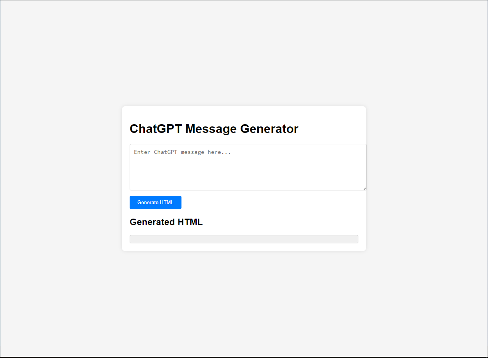

# Convert ChatGPT transcript into HTML
This project consists of simple static web files that convert ChatGPT messages into HTML, allowing for better archiving and viewing. The primary motivation for creating this tool was to present ChatGPT's instructions and lessons in a more readable format, with perfectly formatted code and bash commands. Additionally, the HTML output is easy to share with others, ensuring they can understand the content as well.

### Main Files
1. index.html
2. script.js
3. styles.css

### License and Usage
There are no copyrights, trademarks, or royalties associated with this project. You are free to use it for both commercial and private purposes. This ChatGPT message-to-HTML generator was created entirely by the ChatGPT 4.0 AI. I do not claim full credit and grant full permission for anyone to use this tool without any legal obligations or the need for credit.

### Preview

